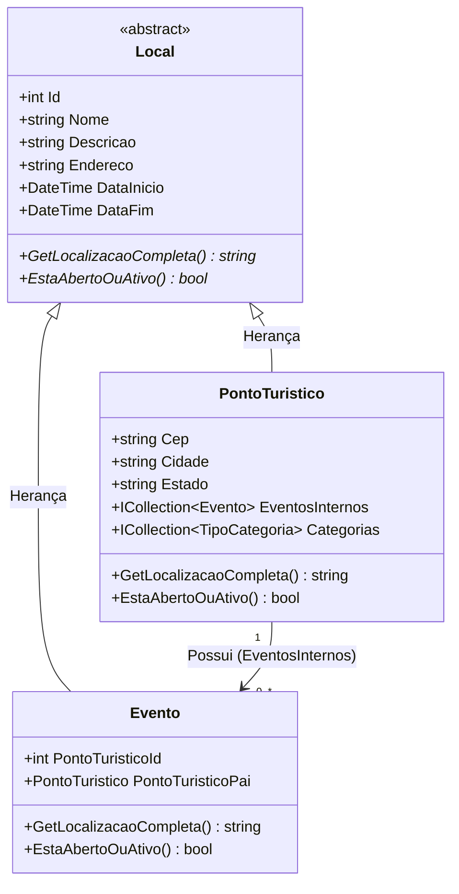

# 🌍 Evertec - Pontos Turísticos

Este projeto é uma aplicação **Full Stack** para gerenciamento de pontos turísticos e eventos associados, desenvolvida como parte de um desafio técnico e estudo. A aplicação permite listar, visualizar e cadastrar locais turísticos com integração total entre Frontend e Backend.

---

## 🏗️ Arquitetura Diagrama
A aplicação segue o modelo **cliente-servidor**, onde o Frontend (React) consome uma API REST (.NET).


* **Frontend:** React + Vite (Hospedado na **Vercel**).
* **Backend:** .NET 10 Web API (Hospedado no **Somee**).
* **Banco de Dados:** SQL Server (Hospedado no **Somee**).
* **Containerização:** Suporte a Docker para desenvolvimento local simplificado.

---

## 🛠️ Requisitos Mínimos

Para rodar este projeto localmente, você precisará obrigatoriamente do **Git** instalado. As demais dependências variam conforme o método escolhido:

### 📦 Geral (Obrigatório)
* **[Git](https://git-scm.com/):** Para clonagem e controle de versão do repositório.

---

### 🐳 Opção 1: Via Docker (Recomendado)
Ideal para rodar o projeto rapidamente sem instalar compiladores na sua máquina.
* **[Docker Engine](https://docs.docker.com/engine/install/):** Instalado e em execução (incluindo o Docker Compose).

---

### 💻 Opção 2: Via Execução Manual (Desenvolvimento)
Necessário caso você pretenda alterar o código e depurar as aplicações localmente.

* **Backend:**
    * **[.NET SDK 10](https://dotnet.microsoft.com/download/dotnet/10.0):** Para compilar e rodar a API C#.
    * **SQL Server:** Pode ser uma instância local ou via container Docker isolado.

* **Frontend:**
    * **[NVM (Node Version Manager)](https://github.com/nvm-sh/nvm):** Recomendado para gerenciar as versões do Node.js.
    * **Node.js (v18 ou superior):** Ambiente de execução Javascript.
    * **NPM (v9 ou superior):** Gerenciador de pacotes (instalado automaticamente com o Node.js).

---

## 🚀 Como Rodar o Projeto

### 0. Clonar o Projeto
Antes de escolher um método de execução, clone o repositório para sua máquina local:
Via SSh
```bash
git clone git@github.com:Gabriel-Assis-22/Evertec-Pontos-Turisticos.git
```

### Opção 1: Via Docker Compose (Recomendado)
Esta é a forma mais simples de subir o ambiente completo (Banco, API e UI) com um único comando.

1.  Abra o terminal na pasta raiz do projeto: `Evertec-Pontos-Turisticos`.
2.  **Para iniciar todos os serviços:**
    ```bash
    docker compose up -d
    ```
3.  **Para encerrar e remover os containers:**
    ```bash
    docker compose down
    ```

---

### ⚙️ Execução Manual (Desenvolvimento)

Caso deseje rodar os serviços separadamente para depuração ou desenvolvimento, siga os passos abaixo:

#### 1. Banco de Dados (SQL Server via Docker)
Se não possuir um SQL Server local, crie o container com as credenciais do projeto e start o conteiner:
```bash
docker run -e "ACCEPT_EULA=Y" -e "MSSQL_SA_PASSWORD=Evertec#2026@SQL" -p 1433:1433 --name sql_server_turismo -d mcr.microsoft.com/mssql/server:2022-latest
```

#### 2. Backend (API)
1.  Abra o terminal na pasta: `backend/TouristSpot.API`.
2.  Execute a aplicação:
    ```bash
    dotnet run
    ```

#### 3. Frontend (UI)
1.  Abra o terminal na pasta: `frontend/TouristSpot.UI`.
2.  Instale as dependências e inicie o servidor de desenvolvimento:
    ```bash
    npm install
    npm run dev
    ```

---

### 🔗 Acesso Local

Independente do método escolhido (Docker ou Manual), após o carregamento dos serviços, você poderá acessar a aplicação em seu navegador através do endereço:

* **Aplicação (Frontend):** [http://localhost:5173/](http://localhost:5173/)

---

## 🌐 Hospedagem e Deploy
O projeto está totalmente **"Live"** e pode ser acessado no link abaixo:

* **💻 Frontend (Produção):** [[Clique aqui para acessar](https://evertec-pontos-turisticos.vercel.app)]

### 🛡️ Detalhes do Deploy
* **CI/CD:** Configurado via integração direta **GitHub + Vercel**.
* **Segurança:** Comunicação via **HTTPS** com política de **CORS** habilitada especificamente para o domínio da Vercel.
* **Banco de Dados:** Migrations automáticas do Entity Framework executadas no *startup* da aplicação no servidor Somee.

---

## 🏗️ Diagrama



