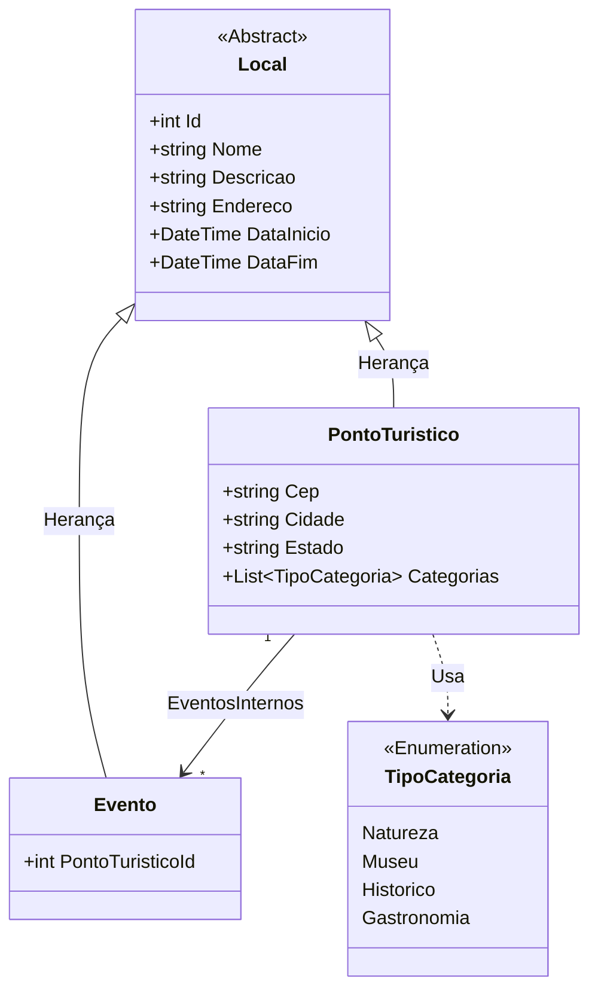

# Evertec-Pontos-Turisticos

```mermaid
   classDiagram
    class Local {
        <<Abstract>>
        +int Id
        +string Nome
        +string Descricao
        +string Endereco
        +DateTime DataInicio
        +DateTime DataFim
    }

    class PontoTuristico {
        +string Cep
        +string Cidade
        +string Estado
        +List~TipoCategoria~ Categorias
    }

    class Evento {
        +int PontoTuristicoId
    }

    class TipoCategoria {
        <<Enumeration>>
        Natureza
        Museu
        Historico
        Gastronomia
    }

    Local <|-- PontoTuristico : Herança
    Local <|-- Evento : Herança
    PontoTuristico "1" --> "*" Evento : EventosInternos
    PontoTuristico ..> TipoCategoria : Usa
    
```

