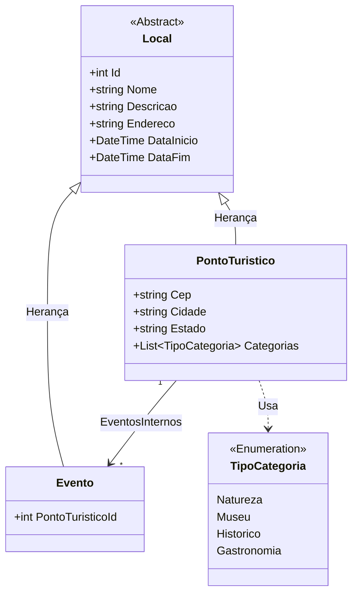

# 🌍 Evertec - Pontos Turísticos

Este projeto é uma aplicação **Full Stack** para gerenciamento de pontos turísticos e eventos associados, desenvolvida como parte de um desafio técnico e estudo. A aplicação permite listar, visualizar e cadastrar locais turísticos com integração total entre Frontend e Backend.

---

## 🏗️ Arquitetura e Diagrama
A aplicação segue o modelo **cliente-servidor**, onde o Frontend (React) consome uma API REST (.NET).


* **Frontend:** React + Vite (Hospedado na **Vercel**).
* **Backend:** .NET 10 Web API (Hospedado no **Somee**).
* **Banco de Dados:** SQL Server (Hospedado no **Somee**).
* **Containerização:** Suporte a Docker para desenvolvimento local simplificado.

---

## 🛠️ Requisitos Mínimos

Para rodar este projeto localmente, as dependências variam conforme o método escolhido:

**Geral:** [Git](https://git-scm.com/) instalado.
* **Via Docker:** Apenas o **Docker Engine** instalado e em execução.
* **Via Execução Manual:** * **.NET SDK 10** instalado.
    * **Node.js** (v18 ou superior) instalado.
    * **SQL Server** (pode ser via Docker ou local).

---

## 🚀 Como Rodar o Projeto

### 0. Clonar o Projeto
Antes de escolher um método de execução, clone o repositório para sua máquina local:
Via SSh
```bash
git clone git@github.com:Gabriel-Assis-22/Evertec-Pontos-Turisticos.git
```

### Opção 1: Via Docker Compose (Recomendado)
Esta é a forma mais simples de subir o ambiente completo (Banco, API e UI) com um único comando.

1.  Abra o terminal na pasta raiz do projeto: `Evertec-Pontos-Turisticos`.
2.  **Para iniciar todos os serviços:**
    ```bash
    docker compose up -d
    ```
3.  **Para encerrar e remover os containers:**
    ```bash
    docker-compose down
    ```

---

### ⚙️ Execução Manual (Desenvolvimento)

Caso deseje rodar os serviços separadamente para depuração ou desenvolvimento, siga os passos abaixo:

#### 1. Backend (API)
1.  Abra o terminal na pasta: `backend/TouristSpot.API`.
2.  Execute a aplicação:
    ```bash
    dotnet run
    ```

#### 2. Frontend (UI)
1.  Abra o terminal na pasta: `frontend/TouristSpot.UI`.
2.  Instale as dependências e inicie o servidor de desenvolvimento:
    ```bash
    npm install
    npm run dev
    ```

---

### 🔗 Acesso Local

Independente do método escolhido (Docker ou Manual), após o carregamento dos serviços, você poderá acessar a aplicação em seu navegador através do endereço:

* **Aplicação (Frontend):** [http://localhost:5173/](http://localhost:5173/)

---

## 🌐 Hospedagem e Deploy
O projeto está totalmente **"Live"** e pode ser acessado no link abaixo:

* **💻 Frontend (Produção):** [[Clique aqui para acessar](https://evertec-pontos-turisticos-git-main-gabriel-assis-22s-projects.vercel.app/)](https://evertec-pontos-turisticos.vercel.app)

### 🛡️ Detalhes do Deploy
* **CI/CD:** Configurado via integração direta **GitHub + Vercel**.
* **Segurança:** Comunicação via **HTTPS** com política de **CORS** habilitada especificamente para o domínio da Vercel.
* **Banco de Dados:** Migrations automáticas do Entity Framework executadas no *startup* da aplicação no servidor Somee.

---

## 🏗️ Diagrama



